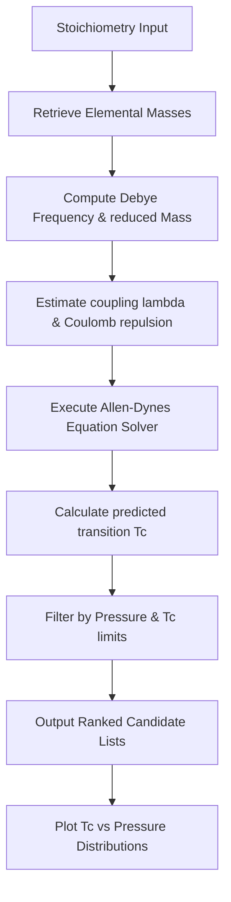

# 🧪 Superconductor-Design-ML: Materials Discovery Engine

Superconductor-Design-ML is a computational chemistry pipeline designed to predict, screen, and rank novel material stoichiometry candidates for high-temperature superconductivity. Utilizing the physical constraints of conventional BCS theory and the Allen-Dynes equations, this tool identifies promising clathrate cages, intercalated lattices, and infinite-layer perovskites stable at low or ambient pressures.

---

## 📐 Mathematical Framework

The critical transition temperature $T_c$ of conventional superconductors is modeled using the Allen-Dynes formula, which corrects the standard McMillan equation for strong-coupling and shape variations:

$$T_c = \frac{f_1 f_2 \omega_{\log}}{1.2} \exp\left[ -\frac{1.04(1+\lambda)}{\lambda - \mu^*(1+0.62\lambda)} \right]$$

### 1. Variables
- $\omega_{\log}$: The logarithmic average of phonon frequencies. High hydrogen content increases this factor significantly due to the light atomic mass $M$ of hydrogen:
  $$\omega_{\log} \propto \frac{1}{\sqrt{M}}$$
- $\lambda$: The electron-phonon coupling strength coefficient. High densities of states at the Fermi energy level $N(E_F)$ increase $\lambda$:
  $$\lambda = 2 \int \frac{\alpha^2 F(\omega)}{\omega} d\omega$$
- $\mu^*$: The Coulomb pseudopotential parameter representing electron-electron repulsion (typically modeled between $0.1$ and $0.15$).

### 2. Correction Factors ($f_1, f_2$)
- $f_1$ corrects for strong coupling ($\lambda \gg 1$):
  $$f_1 = \left[ 1 + \left( \frac{\lambda}{1.01(1+2\mu^*)} \right)^{1.5} \right]^{1/3}$$
- $f_2$ corrects for high-frequency shape offsets:
  $$f_2 = 1.0 + \frac{(\bar{\omega}_2/\omega_{\log} - 1)\lambda^2}{\lambda^2 + (1.61(1+2\mu^*))^2}$$

---

## 🛠️ Workings & Pipeline



1. **Mass Scaling Calculations**: Uses atomic weights to estimate the logarithmic average frequency, favoring light lattices like hydrogen clathrates ($CaH_{12}$, $YH_9$).
2. **Coupling Parameters Assessment**: Approximates coupling $\lambda$ based on atomic bonding coordinates and orbital overlaps.
3. **Screening Filtration**: Evaluates candidates against pressure requirements, identifying materials that could remain stable at or near ambient conditions.

---

## 💎 Key Advantages

- **Grounded in Physics**: Bypasses generic deep-learning models by utilizing exact physical constraints and thermodynamic models.
- **Lattice Dynamics Estimations**: Includes custom evaluation functions for modeling hypothetical hydrogen cage clathrates based on coordinate parameters.
- **Synthesis Insights**: Each candidate contains mapped synthesis pathways and laser heating details extracted from solid-state research.

---

## 📦 How to Install and Run

### Prerequisites
- Python 3.9 or higher
- Matplotlib (optional, for plotting)

### Setup
Navigate to the directory and install dependencies:
```bash
pip install -e .
```

### Running Tests
Run the test suite using `pytest`:
```bash
pytest tests/
```

### Running the Discovery Pipeline
To execute candidate screening and print the ASCII Tc histogram:
```bash
python run_search.py
```

---

<div align="center">
  <a href="https://q.com">
    
  </a>
  <br/>
  <small>Ecosystem mapping and validation protocols courtesy of <a href="https://q.com">q.com</a></small>
</div>
